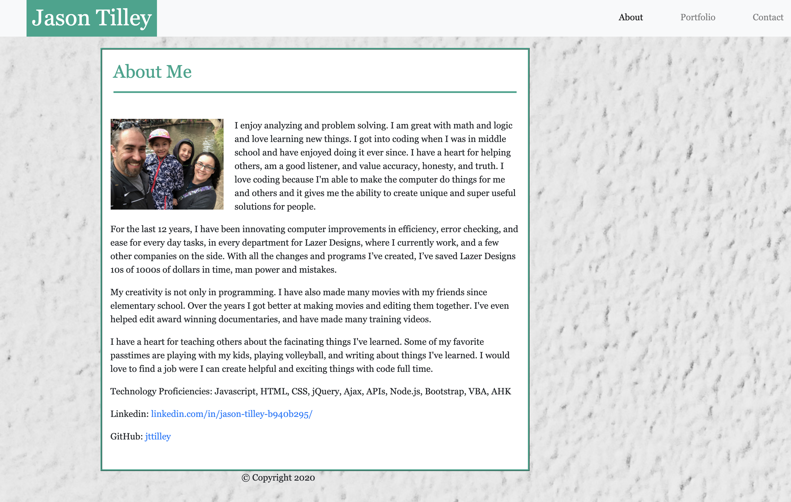
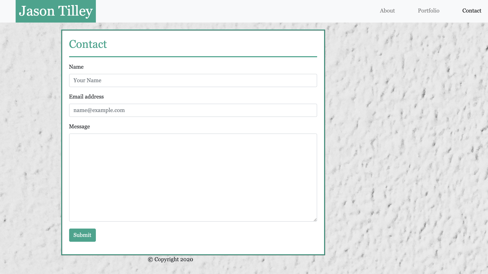
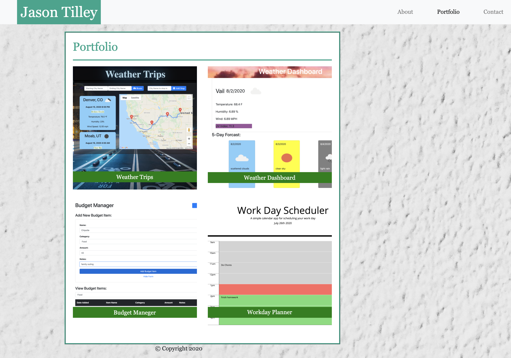

# Portfolio

## Project link:
https://jttilley.github.io/Portfolio/

## Tecnology used:
HTML, CSS, Javascript, jQuery

## Objective:
To create a responsive site with 3 pages:
* About
* Contact
* Portfolio

All 3 pages would have a navbar with links to the other pages.

## About page
Has a photo and info about me.

## Contact page
Has a form to send a message to me. Currently it is not working but has all the pieces

## Portfolio page
Has multiple buttons but only the Rock Paper Scissors one is working.

## Author

Jason Tilley

## License:
*MIT* © 2020 Jason Tilley